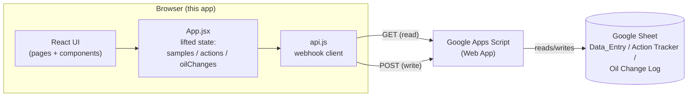

# Architecture

## The big picture



There is no server this app owns or hosts. The React app is a static site
(built with Vite) that talks directly, from the browser, to a Google Apps
Script Web App URL. That script is the only thing that touches the actual
spreadsheet.

## State is lifted to one place

`App.jsx` holds the three core arrays — `samples`, `actions`, `oilChanges`
— in `useState`, and passes them down as props to every page. Every write
operation (`onAddAction`, `onUpdateAction`, `onDeleteAction`,
`onSaveOilChange`, `onAddSample`) also lives in `App.jsx` and is passed down
the same way.

This matters specifically for actions: the **Oil Analysis Report** page's
"Last 5 Actions" panel and the **Action Tracker** page both receive the
exact same `actions` array and the exact same `onUpdateAction` function.
There is only one copy of the data in memory. An edit made from either page
calls the same function, which updates the same array, so both pages
re-render with the new value — there's no separate local copy that could
drift out of sync with the other page.

## The sync bug, and its fix

The previous version of this app (see `oil-analysis-app`, the predecessor
repo) had a real bug: editing an action from the Oil Analysis Report page's
"Last 5 Actions" panel would appear to save (the screen updated), but the
edit would not show up on the Action Tracker page after a refresh, and
would not be in the Google Sheet either.

**Root cause:** every write to the sheet went through:

```js
fetch(webhookUrl, { method: "POST", mode: "no-cors", body: JSON.stringify(payload) });
```

`mode: "no-cors"` is necessary because Apps Script Web Apps don't send CORS
response headers on POST requests — a plain `fetch()` POST would be blocked
by the browser. But `no-cors` mode also makes the response **opaque**: the
calling code cannot read the status code or body. If the Apps Script's
`updateRow` function returned `{status: "row_not_found"}`, or threw an
error, or the request was dropped for any reason, the old app had no way to
detect it. It updated the on-screen state optimistically and assumed
success. The edit _looked_ saved. The next full sync (automatic or manual)
re-read the sheet — which never actually changed — and the edit vanished.

**The fix, in `src/api.js`:** GET requests behave differently. Apps
Script serves a GET's response through a `content.googleusercontent.com`
redirect that _does_ carry permissive CORS headers, so a plain `fetch()`
GET can be read normally — this was confirmed by inspecting the Network tab
against the real deployed script while diagnosing the bug.

So every write function in `api.js` (`saveAction`, `deleteAction`,
`saveOilChange`, `saveSample`) does this:

1. Send the write as a `no-cors` POST (still required, still opaque) —
   `postBlind()`.
2. Immediately follow up with a **normal GET** re-fetching that specific
   equipment's rows — `getEquipmentRows()`.
3. Compare the freshly-read row against what was supposed to be written.
4. If they don't match, throw a `SaveVerificationError` instead of
   returning success.

`App.jsx`'s `onUpdateAction` (etc.) only updates React state — the thing
the UI actually renders — **after** that verification succeeds. If it
fails, a toast (`components/Toast.jsx`) shows the user a real error message
instead of a false "saved" state, and the edit modal stays open so nothing
is lost.

This trades one extra round-trip per write for actually knowing whether the
write worked — worth it for a workflow where a silently-dropped action item
is a real operational risk.

## Page-level notes

- **`OilAnalysisReport.jsx`** and **`ActionTracker.jsx`** both consume the
  action CRUD functions from `App.jsx`. `OilAnalysisReport` renders them
  through the shared `LastActionsPanel` component; `ActionTracker` has its
  own grouped/expandable table UI but calls the identical functions.
- **`LastActionsPanel.jsx`** is intentionally the _only_ place that knows
  how to render the "last N actions for equipment X" widget, so it can be
  reused without duplicating logic.
- **Local caching**: on load, `App.jsx` seeds its state from
  `localStorage` (`config.js`'s `readCache`/`writeCache`) so the UI isn't
  empty while the first sync is in flight, then a real sync runs and
  overwrites it.

See [CODE_GUIDE.md](./CODE_GUIDE.md) for a file-by-file walkthrough.
