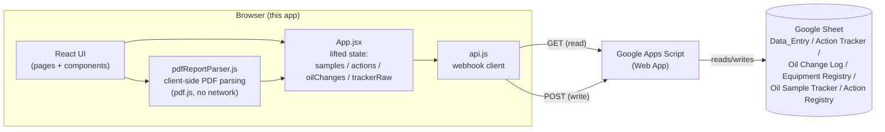

# Architecture

## The big picture



There is no server this app owns or hosts. The React app is a static site
(built with Vite) that talks directly, from the browser, to a Google Apps
Script Web App URL. That script is the only thing that touches the actual
spreadsheet. The one exception to "everything goes through the Apps
Script" is bulk PDF import: parsing an uploaded lab-report PDF happens
entirely in the browser too (pdf.js, no network call at all) — see
[PDF_IMPORT.md](./PDF_IMPORT.md) — and only the resulting sample rows go
through the normal webhook write path.

## State is lifted to one place

`App.jsx` (specifically its inner `AppShell` component — see "Theming" below
for why it's split from `App`) holds the core data arrays — `samples`,
`actions`, `oilChanges`, `trackerRaw` (raw, unparsed Oil Sample Tracker
rows) — in `useState`, and passes them down as props to every page. Every
write operation (`onAddAction`, `onUpdateAction`, `onDeleteAction`,
`onSaveOilChange`, `onAddSample`, `onBulkAddSamples`, `onEditSample`,
`onDeleteSample`) also lives in `App.jsx` and is passed down the same way.

This matters specifically for actions: the **Oil Analysis Report** page's
"Last 5 Actions" panel, the **Action Tracker** page, and the **Oil Report
Search** page (the sidebar's "Oil Analysis Report" destination — a
different, cross-sample view from the contextual per-sample one) all
receive the exact same `actions` array and the exact same
`onUpdateAction`/etc. functions. There is only one copy of the data in
memory. An edit made from any of them calls the same function, which
updates the same array, so every consumer re-renders with the new value —
there's no separate local copy that could drift out of sync.

`trackerByEquip` — the parsed, per-equipment Oil Sample Tracker history
that `SampleTracker.jsx`, `Reports.jsx`, and `OilReportSearch.jsx` all
consume — is derived, not stored directly: `overlaySamplesOnTracker(
parseTrackerRows(trackerRaw), samples)`, memoized in `App.jsx`. This keeps
it always current with respect to `samples` (see "Two equipment lists,
kept separately" below for why `trackerRaw` itself only updates on a real
sync, not automatically) without needing a second write path to keep two
copies in sync.

## Two equipment lists, kept separately from the main sync

Beyond the three data arrays above, `App.jsx` also holds
`equipmentRegistry` and `actionRegistry` — but these are **not** part of
`runSync()` (Full Sync / Quick Sync, which are currently the same call —
see "Known gaps" below). Each is:

- Seeded from a bundled default snapshot of the real sheet
  (`equipmentRegistryDefault.js`, 152 rows; `actionRegistryDefault.js`, 7
  entries) so dropdowns and pickers work correctly even before anyone has
  synced.
- Persisted to its own `localStorage` key, independent of the
  sample/action/oil-change cache (`equipmentRegistry.js`,
  `actionRegistry.js`).
- Only updated by an explicit "Sync Equipment Registry" / "Sync from
  Sheet" action in Settings → Configuration.

This mirrors the original app's own design and matters in practice:
Equipment Registry is the _authoritative_ equipment list (used to build
every equipment dropdown/picker in the app), independent of whether a
given equipment code happens to already have a sample or action row — some
registered equipment has neither yet.

## The sync bug, and its fix

The previous version of this app (see `oil-analysis-app`, the predecessor
repo) had a real bug: editing an action from the Oil Analysis Report page's
"Last 5 Actions" panel would appear to save (the screen updated), but the
edit would not show up on the Action Tracker page after a refresh, and
would not be in the Google Sheet either.

**Root cause:** every write to the sheet went through:

```js
fetch(webhookUrl, { method: "POST", mode: "no-cors", body: JSON.stringify(payload) });
```

`mode: "no-cors"` is necessary because Apps Script Web Apps don't send CORS
response headers on POST requests — a plain `fetch()` POST would be blocked
by the browser. But `no-cors` mode also makes the response **opaque**: the
calling code cannot read the status code or body. If the Apps Script's
`updateRow` function returned `{status: "row_not_found"}`, or threw an
error, or the request was dropped for any reason, the old app had no way to
detect it. It updated the on-screen state optimistically and assumed
success. The edit _looked_ saved. The next full sync (automatic or manual)
re-read the sheet — which never actually changed — and the edit vanished.

**The fix, in `src/api.js`:** GET requests behave differently. Apps
Script serves a GET's response through a `content.googleusercontent.com`
redirect that _does_ carry permissive CORS headers, so a plain `fetch()`
GET can be read normally — this was confirmed by inspecting the Network tab
against the real deployed script while diagnosing the bug.

So every write function in `api.js` (`saveAction`, `deleteAction`,
`saveOilChange`, `saveSample`, `updateSample`, `deleteSample`,
`updateEquipmentRegistryEntry`, `addActionRegistryEntry`) does this:

1. Send the write as a `no-cors` POST (still required, still opaque) —
   `postBlind()`.
2. Immediately follow up with a **normal GET** re-fetching that specific
   equipment's rows — `getEquipmentRows()` (or, for the two registry
   endpoints, a fresh read of that whole registry).
3. Compare the freshly-read row against what was supposed to be written,
   using `rowsEqual()` — with per-write exceptions for columns the backend
   stamps itself (Last Modified) and calendar-day tolerance
   (`sameCalendarDay()`) for date columns, since a date can round-trip
   through a Google Sheets Date-typed cell and come back in a different
   string form than what was sent.
4. If they don't match, throw a `SaveVerificationError` instead of
   returning success — and log exactly which column(s) differed
   (`logVerificationMismatch()`) to the console, so a real mismatch can be
   diagnosed instead of guessed at.

`App.jsx`'s `onUpdateAction` (etc.) only updates React state — the thing
the UI actually renders — **after** that verification succeeds. If it
fails, a toast (`components/Toast.jsx`) shows the user a real error message
instead of a false "saved" state, and the edit modal stays open so nothing
is lost.

This trades one extra round-trip per write for actually knowing whether the
write worked — worth it for a workflow where a silently-dropped action item
is a real operational risk. A **cache-busting `?_=<timestamp>` param plus
`cache: "no-store"`** on every GET (not just the verification one) exists
for the same reason at one more layer down: Apps Script's GET response can
be served through a short-lived caching redirect, and a verify-read
immediately after a write could otherwise come back with the pre-write
response for that same lookup and fail verification even though the write
actually succeeded.

## Best-effort side effects

Two writes in this app deliberately don't block or fail the primary save
if they themselves fail — instead they're fired after the primary save
succeeds, and their own failure surfaces as a _separate_ toast:

- **`applyOilChangeSideEffect`** (`App.jsx`): setting an action's "Last
  Change" date also updates the matching Oil Change Log row (computed by
  `actionAutofill.js`, disambiguated by a lubrication-point picker in
  `EditActionModal.jsx` if the equipment has more than one). If this
  second write fails, the action itself is still saved — the user sees
  "Action saved, but the linked Oil Change Log entry wasn't: …" rather
  than losing the action edit over an unrelated sheet's write failing.
- **`applySampleTrackerSideEffect`** (single-sample `onAddSample`) / the
  inline per-sample loop in **`onBulkAddSamples`**: every new sample also
  updates its own month's cell in the Oil Sample Tracker sheet
  (`updateSampleTracker`). Same reasoning — a tracker-sheet write failing
  shouldn't make the sample itself look unsaved, since the sample row
  really did get appended to `Data_Entry`.

If you add a new cross-sheet side effect, follow this same shape: fire it
_after_ the primary write is confirmed, catch its own errors separately,
and surface them as their own toast rather than throwing back to the
caller.

## Theming

`App.jsx`'s outer `App` component owns only `config` (from `localStorage`)
and wraps everything in `<ThemeProvider themeName={config.themeName}>`
(`ThemeContext.jsx`); the actual app (`AppShell`) is a separate inner
component so it can call `useTheme()` itself. Every component reads colors
and shared style objects via `const { T, s } = useTheme()` — `T` is the
active palette (one of 10, defined in `theme.js`'s `THEMES`, switched
instantly from Settings → Appearance with no reload), `s` is
`buildStyles(T)`, a set of shared inline-style builders (`s.card`, `s.btn`,
`s.input`, `s.table`, `s.badge(status)`, etc.) recomputed for the current
palette. There's no CSS framework — everything is plain inline styles built
from these shared objects, which keeps styling consistent across ~30
components/pages without adding a build dependency. A few files that render
outside the `ThemeProvider`'s reach (`main.jsx`'s `ErrorBoundary`) import
the static `T`/`s` exports from `theme.js` directly instead (always the
default "Navy Dark" palette, since there's no provider to read from yet at
that point in the render tree).

## Page-level notes

- **`OilAnalysisReport.jsx`** (the contextual, per-sample report reached
  from Dashboard/Equipment), **`OilReportSearch.jsx`** (the sidebar's
  standalone "Oil Analysis Report" destination — pick any equipment, see
  every sample as columns plus trend charts), and **`ActionTracker.jsx`**
  (a status-grouped Kanban board, cross-equipment) all consume the same
  action CRUD functions from `App.jsx`. The first two render them through
  the shared `LastActionsPanel` component; `ActionTracker` has its own
  board UI but calls the identical functions.
- **`LastActionsPanel.jsx`** is intentionally the _only_ place that knows
  how to render the "last N actions for equipment X" widget, so it can be
  reused without duplicating logic.
- **Local caching**: on load, `App.jsx` seeds its state from
  `localStorage` (`config.js`'s `readCache`/`writeCache`) so the UI isn't
  empty while the first sync is in flight, then a real sync runs and
  overwrites it.

## Known gaps

- **"Quick Sync" and "Full Sync" are the same call.** Both buttons in
  `Sidebar.jsx` call `runSync()`, which always does a full `readAll()`.
  The Apps Script has a `getChanges` (since-timestamp) endpoint that a
  real incremental sync could use, and `api.js` documents this, but
  nothing in this app calls it yet.
- **Settings' Configuration-tab password (`17593`) is not real security.**
  It's a hardcoded string compared client-side in `Settings.jsx` — visible
  in the built JS bundle to anyone who looks. It exists to keep casual
  users from stumbling into destructive actions (Reset, sheet-URL changes),
  not to gate access from anyone who'd actually inspect the app.
- **Sample edit/delete match key (`[unitId, sampleId]`) isn't guaranteed
  unique** — see [SHEET_SCHEMA.md](./SHEET_SCHEMA.md#data_entry-samples).
  This app currently only appends new samples through the normal Add
  Sample / bulk import flows; `updateSample`/`deleteSample` (used by
  Equipment's Edit/Delete Sample buttons) can target the wrong row for the
  rare equipment+Sample ID pair that repeats across different dates.
- **Equipment Registry writes never touch the Contractor column** — see
  the comment on `equipmentRegistryRow()` in `api.js` and
  [SHEET_SCHEMA.md](./SHEET_SCHEMA.md#equipment-registry). Editing an
  equipment's sampling interval from Settings only ever sends 9 of the
  sheet's 10 columns, by design, to avoid risking a stale contractor value
  overwriting the real one.

See [CODE_GUIDE.md](./CODE_GUIDE.md) for a file-by-file walkthrough, or
[PDF_IMPORT.md](./PDF_IMPORT.md) for the bulk PDF import feature
specifically.
